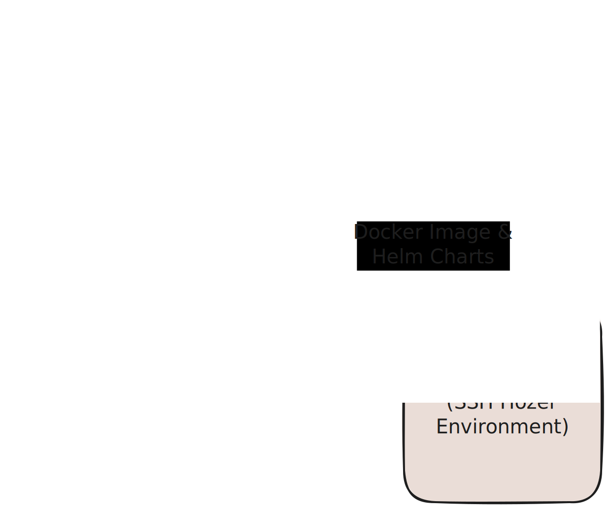

# Deployment Environments & CI/CD Workflow

<!-- toc -->

## What are Deployment Environments?

Berkeleytime has three deployment environments: production, staging, and development. The production environment refers to the live deployed website seen by users of Berkeleytime and should contain code already tested in the other two environments. The staging and development environments are primarily used by Berkeleytime developers/designers to test new code.
- **Production**: Finalized changes merged in `main` are *manually* deployed here at [beta.berkeleytime.com](https://beta.berkeleytime.com)
- **Staging**: Changes already merged in `main` are *automatically* deployed here at [staging.stanfurdime.com](https://staging.stanfurdime.com)
- **Development**: Specific git branches can be *manually* deployed here.

## The CI/CD Github Actions

We use GitHub actions to build our CI/CD workflows.[^1] All three CI/CD workflows[^2] are fairly similar to each other and can all be broken into two phases: the build and the deploy phase.

1. **Build Phase**: An application container and Helm chart are *built* and *pushed* to a registry. We use [Docker Hub](https://hub.docker.com/). This process is what `.github/workflows/cd-build.yaml` is responsible for and is run in the Github Action environment.

2. **Deploy Phase**: After the container and Helm chart are built and pushed to a registry, they are *pulled* and *deployed* onto `hozer-51`. This process is what `.github/workflows/cd-deploy.yaml` is responsible for and is run in the Github Action environment `ssh`'d into `hozer-51`.

    

### Comparing Deployment Environment Actions

The differences between the three environments are managed by each individual workflow file: `cd-dev.yaml`, `cd-stage.yaml`, and `cd-prod.yaml`.

| | Development | Staging | Production |
| --- | --- | --- | --- |
| k8s Pod Prefix | `bt-dev-*` | `bt-stage-*` | `bt-prod-*` |
| Container Tags | `[commit hash]` | `latest` | `prod` |
| Helm Chart Versions[^3] | `0.1.0-dev-[commit hash]` | `0.1.0-stage` | `1.0.0` |
| TTL (Time to Live) | `[GitHub Action input]` | N/A | N/A |
| Deployment Count Limit | 8 | 1 | 1 |
| Datapuller `suspend` | `true` | `false` | `false` |

[^1]: In the past, we have used a self-hosted GitLab instance. However, the CI/CD pipeline was obscured behind a admin login page. Hopefully, with GitHub actions, the deployment process will be more transparent and accessible to all engineers. Please don't break anything though!

[^2]: Development, Staging, and Production

[^3]: Ideally, these would follow [semantic versioning](https://semver.org/), but this is rather difficult to enforce and automate.
