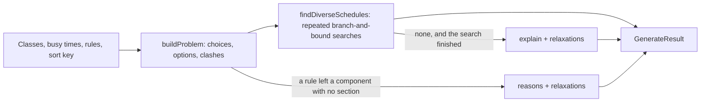

# Schedule generator (`lib/scheduler`)

This folder powers the **Generate** button in the schedule editor. Given the
classes in a schedule, the student's busy times and their rules ("no classes
before 10", "keep Fridays free"), it returns up to 8 schedules that follow
every rule. The first is the best one for the sort key the student picked,
and each next one is the best that is clearly different from those before
it. When nothing fits, it says why and which rule to turn off.

What to know before changing it:

- **Rules are enforced, not weighed.** A section that breaks a rule is left
  out, unless the student locked it.
- **One sort key, chosen by the student:** fewest gaps, fewest days, latest
  start or earliest finish. Ties go to fewer closed sections, then fewer
  gaps, then fewer days.
- **The first result is the true best**, not the best of a sample: the
  search is branch-and-bound, which skips only schedules it can prove are
  worse.
- **Plain functions.** Everything except `apply.ts` is plain TypeScript with no
  React or network calls. A run takes 3-31 ms on the test inputs, so the
  dialog calls it directly on the main thread, with a 100 ms time budget as a
  safety net.

## Contents

1. [Quick start](#quick-start)
2. [Glossary](#glossary)
3. [How it works](#how-it-works)
4. [Files and functions](#files-and-functions)
5. [Algorithms, why we use them, and their tradeoffs](#algorithms-why-we-use-them-and-their-tradeoffs)
6. [Performance](#performance)
7. [What we removed and when to bring it back](#what-we-removed-and-when-to-bring-it-back)
8. [Adding a rule or a sort key](#adding-a-rule-or-a-sort-key)
9. [Known limits](#known-limits)
10. [Testing and benchmarks](#testing-and-benchmarks)
11. [References](#references)

## Quick start

```ts
import { generateSchedules } from "@/lib/scheduler";
import { DEFAULT_PREFERENCES } from "@/lib/scheduler/preferences";

const result = generateSchedules(classes, events, {
  ...DEFAULT_PREFERENCES,
  earliestStart: 10 * 60, // rule: no classes before 10:00
  sortBy: "fewest-days",
});

result.schedules[0].classes; // [{ classIndex, sectionIds }]
result.stoppedEarly; // true if the time budget ran out
result.reasons; // why nothing fits, when schedules is empty
result.relaxations; // rules that, turned off alone, would let a schedule fit
```

`classes` and `events` are the schedule's non-hidden `IScheduleClass` and
`IScheduleEvent` objects. They satisfy the input types in `types.ts` as they
are.

## Glossary

| Term        | Meaning here                                                                                                                                                          |
| ----------- | --------------------------------------------------------------------------------------------------------------------------------------------------------------------- |
| Class       | One lecture plus the discussions and labs tied to it (Berkeleytime's `Class`).                                                                                        |
| Section     | One enrollable offering, with its own id, meeting times and seats.                                                                                                    |
| Component   | The kind of section: LEC, DIS, LAB, ... A student takes one section per component.                                                                                    |
| Choice      | One decision: which section to use for one component of one class.                                                                                                    |
| Option      | All sections of one choice that meet at exactly the same times in the same weeks. They are interchangeable for scheduling, so the search picks options, not sections. |
| Clash       | Two options that meet on the same day at overlapping times in overlapping weeks.                                                                                      |
| Rule        | A filter the student set: no classes before or after a time, days kept free, open sections only.                                                                      |
| Sort key    | What "best" means: fewest gaps, fewest days, latest start or earliest finish.                                                                                         |
| Cost        | One number per schedule that orders schedules exactly like the sort key and its tie-breaks. Lower is better.                                                          |
| Floor       | A lower bound: the least cost any completion of a partial schedule can have.                                                                                          |
| Time budget | How long the search may run (100 ms by default) before it returns what it has.                                                                                        |

## How it works



A worked example. Say a schedule has CS 61A, whose lecture has 40 discussions
at 14 distinct times and 30 labs at 12 distinct times.

1. **Build the problem** (`normalize.ts`). CS 61A becomes three choices: LEC
   (1 option), DIS (14 options), LAB (12 options).
   - Sections that break a rule or overlap a busy time are dropped first.
   - The 40 discussions collapse to 14 options because sections at the same
     time are interchangeable.
   - Each option records the options it clashes with, the days it meets, its
     earliest start and latest end, its class minutes, and whether its
     section is closed.
2. **Find the best schedule** (`search.ts`). Fill one choice at a time,
   always the one with the fewest options left. After each pick, cross out
   the options of other choices that clash with it. Before going deeper,
   compute the floor of the partial schedule; if it cannot beat the best
   schedule found so far, back up.
3. **Find the next ones** (`diversify.ts`). Search again for the best
   schedule that differs from every earlier result in at least half of the
   choices that have more than one option. Repeat until 8 results.
4. **Explain** (`explain.ts`, `index.ts`). Only when nothing fits. It reports,
   for example, "CS 61A and Data 8 always overlap" or "every Data 8 lab meets
   on a day you keep free", and which rules, turned off alone, would let a
   schedule fit.

## Files and functions

| File             | Function or type                                                                                                                                          | What it does                                                                                                                                                      |
| ---------------- | --------------------------------------------------------------------------------------------------------------------------------------------------------- | ----------------------------------------------------------------------------------------------------------------------------------------------------------------- |
| `index.ts`       | `generateSchedules(classes, events, preferences, options?)`                                                                                               | Entry point. Runs the steps above and returns `GenerateResult`.                                                                                                   |
| `index.ts`       | `turnOff(rule, preferences)`                                                                                                                              | The preferences with one rule set back to off. Used for relaxation hints and by the dialog's buttons.                                                             |
| `index.ts`       | `totalsOf(problem, picked)`                                                                                                                               | Days, gaps, first start, last end and closed sections of a schedule.                                                                                              |
| `index.ts`       | `DEFAULT_OPTIONS`                                                                                                                                         | `count: 8`, `budgetMs: 100`.                                                                                                                                      |
| `types.ts`       | `GeneratorClass`, `GeneratorSection`, `GeneratorEvent`, `GenerateResult`, `GeneratedSchedule`, `Reason`, `Rule`                                           | Public input and output shapes.                                                                                                                                   |
| `normalize.ts`   | `buildProblem(classes, events, preferences)`                                                                                                              | Applies locks, exclusions, rules and busy times; merges sections into options; finds clashes; orders each choice's options for the sort key. Returns a `Problem`. |
| `normalize.ts`   | `Problem`, `Choice`, `Option`, `isClosed`                                                                                                                 | Internal data and a seat helper.                                                                                                                                  |
| `objective.ts`   | `createObjective(sortBy, choiceCount)`, `costOf(objective, totals)`, `Totals`                                                                             | Turns the sort key and its tie-breaks into one cost to minimize.                                                                                                  |
| `search.ts`      | `search(problem, choiceIds, previous, minDistance, clock)`, `createClock(budgetMs)`                                                                       | Branch-and-bound: the lowest-cost schedule at least `minDistance` choices away from each schedule in `previous`.                                                  |
| `diversify.ts`   | `findDiverseSchedules(problem, count, clock)`                                                                                                             | Repeated searches that build the list of clearly different results.                                                                                               |
| `explain.ts`     | `explain(problem, classCount, clock)`                                                                                                                     | Finds which classes cannot fit together.                                                                                                                          |
| `time.ts`        | `toIntervals`, `toBusyIntervals`, `roundListedEnd`, `toDateRange`, `rangesOverlap`, `intervalsOverlap`                                                    | Parsing meeting times and dates, and overlap checks.                                                                                                              |
| `preferences.ts` | `GeneratorPreferences`, `DEFAULT_PREFERENCES`, `SORT_KEYS`, `sanitizePreferences`, `loadPreferences`, `savePreferences`, `toSundayFirst`, `toMondayFirst` | The rules form's data, saved in `localStorage`.                                                                                                                   |
| `apply.ts`       | `applyGeneratedSelection(classes, generated)`                                                                                                             | Applies a chosen result: changes only the selected sections of generated classes.                                                                                 |
| `fixtures.ts`    | `section`, `scheduleClass`, `realisticClasses`, `realLikeClasses`, `adversarialClasses`, ...                                                              | Builders for tests and benchmarks. Not used by the app.                                                                                                           |

The dialog that calls all this is
`src/app/Schedule/Editor/GenerateSchedulesDialog/index.tsx`.

## Algorithms, why we use them, and their tradeoffs

### 1. Model: choices, options and clashes

- **What.** One choice per (class, component). Its options are the sections
  that survive the rules, merged by time. A schedule is one option per choice
  with no two options clashing. This is the textbook constraint satisfaction
  model (Russell and Norvig, ch. 6).
- **Why.** With 3-4 classes there are only 6-12 choices. The difficulty is
  that each has up to dozens of options, so raw combinations reach
  10^8-10^14.
- **Tradeoff.** "Exactly one section per component" is built in. Optional
  components need an explicit rule; see [Known limits](#known-limits).

### 2. Merging interchangeable sections into options

- **What.** Sections of one component that meet at exactly the same times
  and weeks become one option. The section actually used is the student's
  current one if it is in the option, otherwise the one most likely to have
  a seat.
- **Why.** For clashes and for every sort key, such sections are
  interchangeable values in the sense of Freuder (1991), so keeping one loses
  no schedule. It also stops results from showing schedules that differ only
  in room.
- **Tradeoff.** It shrinks the search much less on real data than on
  synthetic data: about 300x on `realisticClasses`, but only about 2x on
  real Fall 2026 sections (17x at best, for COMPSCI 61A), where most
  sections have a time of their own. The search is fast because of pruning
  (section 5), not merging.

### 3. Rules as filters

- **What.** Before searching, sections that break a rule are removed:
  - starting before `earliestStart` or ending after `latestEnd`;
  - meeting on an avoided day;
  - closed, when "only open sections" is on.

  Locked sections are never removed by rules. Busy times remove every
  section that overlaps them, locked or not.

- **Why.** It is exactly what the student asked for and is easy to explain.
  It also makes the search smaller.
- **Tradeoff.** Contradictory rules leave nothing, for example keeping
  Fridays free when a lab only runs on Fridays. The student then sees why
  and a one-click option to turn that rule off (section 7).

### 4. Objective: the sort key as one number

- **What.** `objective.ts` turns the sort key and its tie-breaks into a
  weighted sum. For "fewest gaps" the terms are gaps, then closed sections,
  then days. Each term's weight is larger than the most that all later terms
  can add up to, so a lower cost always means better on the first term that
  differs. This is the standard way to turn a lexicographic order (compare
  term by term) into one number.
- **Why.** The search compares and bounds one number at a time, which keeps
  it simple and fast.
- **Tradeoff.** Each term needs a known largest value (gaps up to 7 x 24
  hours, days up to 7, and so on) to set the weights. A new term needs one
  too.

### 5. Finding the best schedule: branch-and-bound

- **What.** `search.ts` is a depth-first branch-and-bound search (Land and
  Doig, 1960) with three standard parts:
  - **Fewest options first.** It always fills the choice with the fewest
    options left, so dead ends show up near the top of the search
    ("fail first"; Haralick and Elliott, 1980).
  - **Forward checking.** After each pick it crosses out the options of
    other choices that clash with it. A choice left with no option ends that
    path at once (Haralick and Elliott, 1980).
  - **Floor.** For each partial schedule it computes the least cost any
    completion can have. If that cannot beat the best schedule found so far,
    the whole subtree is skipped.

  The floor bounds each term separately, using what every open choice must
  add whichever option it gets:

  | Term            | Floor for a partial schedule                                                                                                                                          |
  | --------------- | --------------------------------------------------------------------------------------------------------------------------------------------------------------------- |
  | Gaps            | Time on campus so far, minus class time so far, minus the most class time the open choices can still add; at least 0. Time on campus only grows as classes are added. |
  | Days            | Days used so far, plus days that every remaining option of some open choice meets on.                                                                                 |
  | Closed sections | Closed so far, plus the fewest each open choice can add.                                                                                                              |
  | Latest start    | The week cannot start later than the earliest of: the start so far, and for each open choice its latest-starting option.                                              |
  | Earliest finish | The week cannot end earlier than the latest of: the end so far, and for each open choice its earliest-ending option.                                                  |

  Within a choice, options that look best on their own are tried first (for
  "latest start", the latest ones), so a good schedule is found early and
  more of the rest can be skipped.

- **Why.** On real data hundreds of thousands of schedules follow the
  rules. Listing them all is too slow, and listing a capped number and
  sorting them misses the best. On `realLikeClasses` (510,000-930,000
  schedules, seeds 7, 11 and 23), the best of the first 20,000 had 240-480
  minutes of gaps where the true best has 60-270, and finished at 4:30-5:30
  PM where the true best finishes at 2:00-3:30 PM. Branch-and-bound finds the
  true best and visits 1,500-48,000 nodes to return 8 results.
- **Tradeoff.**
  - Every sort term needs a valid floor. A term without one makes the search
    skip schedules it should not, and silently return a worse result. The
    brute-force tests catch this (see [Testing](#testing-and-benchmarks)).
  - The floors are loose early in the search, when few choices are filled.
    Search time grows with how many schedules are close to the best.

### 6. Variety: repeated searches at a distance

- **What.** `diversify.ts` runs the search once for the best schedule, then
  again for the best schedule that differs from every earlier result in at
  least half of the choices that have more than one option. The search
  enforces this as a constraint: a partial schedule that can no longer get
  far enough from some earlier result is skipped. When no schedule that far
  away exists, the distance drops by one. This is the greedy approach to
  finding diverse solutions described by Hebrard, Hnich, O'Sullivan and
  Walsh (2005).
- **Why.** Without it, the top 8 by cost are near-copies that differ in one
  lab time.
- **Tradeoff.**
  - Results after the first are not the 2nd, 3rd, ... best overall; each is
    the best among schedules different enough from the ones above it.
  - It costs one search per result, so "Show more" re-runs the searches for
    the longer list.

### 7. Explaining nothing fits

- **What.**
  - If a rule or busy time removed every section of a component,
    `buildProblem` reports which check did it.
  - Otherwise `explain` searches each class alone, then each pair, and
    reports the smallest groups that cannot fit.
  - In both cases `index.ts` searches once per active rule with that rule
    off. Rules that let a schedule fit are offered in the dialog as one-click
    buttons ("Allow classes on Friday").
- **Why.** QuickXplain (Junker, 2004) finds minimal conflicts and relaxations
  among many constraints. Here a schedule has a handful of classes (6
  classes make 21 single and pair groups) and 4 rules, so trying each
  directly is simpler and covers the common cases.
- **Tradeoff.**
  - Only single-rule relaxations are suggested. If two rules must both go,
    the student sees the reasons but no button.
  - Conflicts that need three or more classes at once get a general message:
    "Couldn't find a combination that fits all of your classes at once".
  - A group whose search hits the time budget counts as fitting, so the
    explanation never blames classes without proof. "Nothing fits" itself is
    only reported when the main search finished.

### 8. Time budget

- **What.** All searches in one call share a 100 ms budget (`createClock`).
  The search reads the clock every 256 nodes; when time is up it returns the
  best schedules found so far with `stoppedEarly: true`. Explaining gets a
  budget of its own.
- **Why.** The search runs on the main thread, so a slow device or an
  unusual input must not freeze the page.
- **Tradeoff.** Results can depend on device speed when the budget is hit.
  On the test inputs the full search takes at most 31 ms, so this is a
  safety net.

## Performance

Measured on the synthetic inputs in `fixtures.ts`, on a development machine
(Node 22, median of 9 runs after warm-up). Each run returns 8 results with no
time budget, so it times the full search.

| Input                                                                 | Combinations after merging | fewest gaps | fewest days | latest start | earliest finish |
| --------------------------------------------------------------------- | -------------------------- | ----------- | ----------- | ------------ | --------------- |
| `realisticClasses`: 4 large classes, merging saves 300x               | 1.1-1.3 x 10^6             | 4-9 ms      | 4-9 ms      | 4-9 ms       | 3-5 ms          |
| `realLikeClasses`: the same classes, merging saves about 2x           | 1.2-1.4 x 10^8             | 9-31 ms     | 8-23 ms     | 8-20 ms      | 4-6 ms          |
| `adversarialClasses`: 4 x (60 discussions + 60 labs at 30 times each) | 7-9 x 10^10                | 10-14 ms    | 10-14 ms    | 13-20 ms     | 11-14 ms        |

Ranges cover seeds 7, 11 and 23. `vitest bench` gives similar means: 8 ms,
30 ms and 12 ms for fewest gaps with no rules on the three inputs, and 4-10
ms for latest start with "no classes before 9 or after 6".

Search time follows how many partial schedules the floors cannot rule out,
not the raw combinations: the worst case has 600 times more combinations
than the real-like input but is not slower.

On a phone 3-5 times slower, the slowest case here (31 ms) would take about
90-155 ms and could hit the budget. It would then return good but possibly
not best schedules, marked `stoppedEarly`. The dialog sends `elapsedMs`,
`nodes` and `stoppedEarly` in the `schedule_generate` tracking event so real
devices can be checked.

## What we removed and when to bring it back

Earlier versions of this branch had more machinery. Each piece was removed
because, at these sizes, the simpler design does the job and is easier to
review and explain.

| Removed                                     | What it did                                                                                                                                                             | Bring it back if                                                                                                   |
| ------------------------------------------- | ----------------------------------------------------------------------------------------------------------------------------------------------------------------------- | ------------------------------------------------------------------------------------------------------------------ |
| Weighted soft preferences                   | Ranked by a weighted sum of preferences (minutes outside preferred hours, avoided days, campus time); a schedule could break a preference if it scored better elsewhere | Students ask for "prefer, don't require". The search supports it: a soft preference is one more term with a floor. |
| "Within 5% of best" mode and quality labels | Traded exactness for speed in stages                                                                                                                                    | The budget is hit often on real devices (`stoppedEarly` in tracking).                                              |
| Web Worker and its hook                     | Kept the page responsive during long searches                                                                                                                           | Tracked `elapsedMs` at the 95th percentile exceeds about 100 ms.                                                   |
| Backup sections per choice                  | Listed sections that could replace each chosen one                                                                                                                      | The UI gets a place to show them (planned for P2).                                                                 |
| Counting schedules ("420 schedules fit")    | Listed every schedule up to a cap to count them                                                                                                                         | Students need the count; counting up to a cap with plain backtracking costs about 1 ms per 10,000.                 |

## Adding a rule or a sort key

- **A rule.**
  1. Add the field to `GeneratorPreferences`, `DEFAULT_PREFERENCES` and
     `sanitizePreferences` in `preferences.ts`.
  2. Add a check to `checks()` in `normalize.ts`, with a `Reason` kind so
     the dialog can explain it.
  3. Add it to `Rule` in `types.ts`, and to `RULES` and `isActive` in
     `index.ts`, so it can be suggested for relaxing.
  4. Give it a control, a reason message and a relaxation label in the
     dialog.
- **A sort key.**
  1. Add it to `SortKey` and `SORT_KEYS` in `preferences.ts`.
  2. Add its terms to `ORDER` in `objective.ts`. A new kind of term also
     needs a field in `Totals`, a largest value, and a line in `costOf`.
  3. Give each new term a floor in `search.ts`: a value that no completion
     of the partial schedule can beat. Terms that only grow as classes are
     added (like days) or that each option adds on its own (like closed
     sections) are easy; see the table in section 5.
  4. Optionally, order options for it in `promisingFirst` in `normalize.ts`.
  5. Add an option to the dialog's "Sort by" list.
- **A test.** Both brute-force tests in `index.test.ts` loop over every sort
  key, so a new key is covered once it is in `SORT_KEYS`. They fail if a
  floor is wrong.

## Known limits

Checked against Fall 2026 data with the Phase 0 measurement script
(`scripts/measure-schedule-generator.ts`, not yet merged), except where
noted:

- **Berkeley time.** End times ending in :x9 are rounded up one minute
  (`roundListedEnd`), because SIS lists 10:10-11:00 as 10:00-10:59. 97% of
  Fall 2026 meetings end at :59 or :29; four end at :14 and are not rounded.
- **Optional components.** Every component is treated as required, including
  the 19 Voluntary (VOL) and Supplementary (SUP) sections across 13 courses.
  To make them optional, skip those component codes in `toGroups` in
  `normalize.ts`. `type` cannot be used for this: nearly every discussion
  and lab is `type` N.
- **Time not announced.** A section meeting that starts at 00:00 is treated
  as having no time and never clashes. Busy times are exempt: one that starts
  at 00:00 really starts at midnight (`toBusyIntervals`).
- **Half-term sections.** Clashes respect each section's date range, but
  gaps and days do not, so two sections that never run in the same weeks can
  still count toward the same day's gaps.
- **Seat data.** "Only open sections" and the closed-section tie-break use
  `enrollment.latest`, which is polled every 15 minutes.
- **Explanations.** Conflicts that need three or more classes get a general
  message.

## Testing and benchmarks

From `apps/frontend`:

```sh
npx vitest run src/lib/scheduler     # unit and brute-force tests
npx vitest bench src/lib/scheduler   # benchmarks in generate.bench.ts
```

- **`index.test.ts`**
  - **Random inputs.** 60 small random inputs with random rules, cycling
    through every sort key. The first result must equal the brute-force best
    on the sort key and every tie-break. Every result must follow the rules,
    be clash-free and differ from the others.
  - **Real-like input.** Brute force over all 930,000 schedules of
    `realLikeClasses()`. For every sort key, the first result must equal the
    true best. Listing and sorting a capped number of schedules fails this
    test.
  - Also covers locks, exclusions, busy times (including one at midnight),
    time-TBA meetings, date ranges, Berkeley time, variety, explanations,
    relaxation hints and the time budget.
- **`time.test.ts`, `apply.test.ts`, `preferences.test.ts`:** cover the
  smaller modules.

## References

- Freuder, E. C. (1991). Eliminating interchangeable values in constraint satisfaction problems. AAAI-91.
- Haralick, R. M., and Elliott, G. L. (1980). Increasing tree search efficiency for constraint satisfaction problems. Artificial Intelligence 14(3).
- Hebrard, E., Hnich, B., O'Sullivan, B., and Walsh, T. (2005). Finding diverse and similar solutions in constraint programming. AAAI-05.
- Junker, U. (2004). QUICKXPLAIN: Preferred explanations and relaxations for over-constrained problems. AAAI-04.
- Land, A. H., and Doig, A. G. (1960). An automatic method of solving discrete programming problems. Econometrica 28(3).
- Russell, S., and Norvig, P. (2020). Artificial Intelligence: A Modern Approach, 4th ed., chapter 6 (Constraint Satisfaction Problems).
