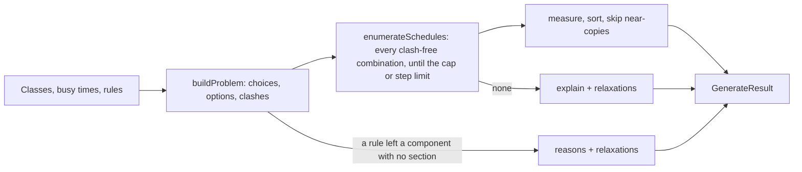

# Schedule generator (`lib/scheduler`)

This folder powers the **Generate** button in the schedule editor. Given the
classes in a schedule, the student's busy times and their rules ("no classes
before 10", "keep Fridays free"), it lists the conflict-free schedules that
follow the rules, sorts them the way the student picked, and returns the first 8. When nothing fits, it says why and which rule to turn off.

What to know before changing it:

- **Rules are enforced, not weighed.** A section that breaks a rule is left
  out, unless the student locked it.
- **Sorting is one key the student picks:** fewest gaps, fewest days, latest
  start or earliest finish. Ties go to fewer closed sections, then fewer
  gaps, then fewer days.
- **Results are not near-copies.** A schedule that differs from an earlier
  result in only one choice is moved to the back.
- **Plain functions.** Everything except `apply.ts` is plain TypeScript with no
  React or network calls. A typical run takes 2-33 ms on a development machine, so
  the dialog calls it directly on the main thread.

This is phase P1 ("solver core") of the schedule generator design doc,
simplified on purpose; see [What we removed and when to bring it back](#what-we-removed-and-when-to-bring-it-back).

## Contents

1. [Quick start](#quick-start)
2. [Glossary](#glossary)
3. [How it works](#how-it-works)
4. [Files and functions](#files-and-functions)
5. [Algorithms, why we use them, and their tradeoffs](#algorithms-why-we-use-them-and-their-tradeoffs)
6. [Performance](#performance)
7. [What we removed and when to bring it back](#what-we-removed-and-when-to-bring-it-back)
8. [Adding a rule or a sort key](#adding-a-rule-or-a-sort-key)
9. [Assumptions to confirm](#assumptions-to-confirm)
10. [Testing and benchmarks](#testing-and-benchmarks)
11. [References](#references)

## Quick start

```ts
import { generateSchedules } from "@/lib/scheduler";
import { DEFAULT_PREFERENCES } from "@/lib/scheduler/preferences";

const result = generateSchedules(classes, events, {
  ...DEFAULT_PREFERENCES,
  earliestStart: 10 * 60, // no classes before 10:00
  sortBy: "fewest-days",
});

result.schedules[0].classes; // [{ classIndex, sectionIds }]
result.total; // how many schedules follow the rules, counted until the search stops
result.truncated; // true if the search stopped early (see "Listing schedules")
result.reasons; // why nothing fits, when schedules is empty
result.relaxations; // e.g. [{ rule: "avoidDays", count: 34 }]
```

`classes` and `events` are the schedule's non-hidden `IScheduleClass` and
`IScheduleEvent` objects. They satisfy the input types in `types.ts` as they
are.

## Glossary

| Term       | Meaning here                                                                                                                                                          |
| ---------- | --------------------------------------------------------------------------------------------------------------------------------------------------------------------- |
| Class      | One lecture plus the discussions and labs tied to it (Berkeleytime's `Class`).                                                                                        |
| Section    | One enrollable offering, with its own id, meeting times and seats.                                                                                                    |
| Component  | The kind of section: LEC, DIS, LAB, ... A student takes one section per component.                                                                                    |
| Choice     | One decision: which section to use for one component of one class.                                                                                                    |
| Option     | All sections of one choice that meet at exactly the same times in the same weeks. They are interchangeable for scheduling, so the search picks options, not sections. |
| Clash      | Two options that meet on the same day at overlapping times in overlapping weeks.                                                                                      |
| Rule       | A preference the student set: no classes before or after a time, days kept free, open sections only.                                                                  |
| Cap        | The most schedules listed in one run (20,000).                                                                                                                        |
| Step limit | The most options the search tries in one run (1,000,000), including tries that lead nowhere.                                                                          |

## How it works



A worked example. Say a schedule has CS 61A, whose lecture has 40 discussions
at 14 distinct times and 30 labs at 12 distinct times.

1. **Build the problem** (`normalize.ts`). CS 61A becomes three choices: LEC
   (1 option), DIS (14 options), LAB (12 options).
   - Sections that break a rule or overlap a busy time are dropped first.
   - The 40 discussions collapse to 14 options because sections at the same
     time are interchangeable.
   - Every pair of options is checked once for clashes.
2. **List schedules** (`enumerate.ts`). Fill one choice at a time, choices
   with the fewest options first. Back up as soon as a pick clashes with an
   earlier pick. Stop after 20,000 schedules or 1,000,000 tries.
3. **Measure and sort** (`rank.ts`). Count days on campus, gap time, earliest
   start and latest finish for each schedule, then sort by the student's key.
4. **Pick 8** (`rank.ts`). Take schedules in sorted order, moving near-copies
   to the back.
5. **Explain** (`explain.ts`, `index.ts`). Only when nothing fits. It reports,
   for example, "CS 61A and Data 8 always overlap" or "every Data 8 lab meets
   on a day you keep free". It also lists the rules that, turned off alone,
   would let schedules fit.

## Files and functions

| File             | Function or type                                                                                                                                          | What it does                                                                                                       |
| ---------------- | --------------------------------------------------------------------------------------------------------------------------------------------------------- | ------------------------------------------------------------------------------------------------------------------ |
| `index.ts`       | `generateSchedules(classes, events, preferences, options?)`                                                                                               | Entry point. Runs the steps above and returns `GenerateResult`.                                                    |
| `index.ts`       | `turnOff(rule, preferences)`                                                                                                                              | The preferences with one rule set back to off. Used by relaxation hints and the dialog's buttons.                  |
| `index.ts`       | `DEFAULT_OPTIONS`, `RELAXATION_CAP`                                                                                                                       | `count: 8`, `cap: 20000`; relaxation hints count up to 1,000.                                                      |
| `types.ts`       | `GeneratorClass`, `GeneratorSection`, `GeneratorEvent`, `GenerateResult`, `Reason`, `Relaxation`, `Rule`                                                  | Public input and output shapes.                                                                                    |
| `normalize.ts`   | `buildProblem(classes, events, preferences)`                                                                                                              | Applies locks, exclusions, rules and busy times; merges sections into options; finds clashes. Returns a `Problem`. |
| `normalize.ts`   | `Problem`, `Choice`, `Option`, `isClosed`                                                                                                                 | Internal data and a seat helper.                                                                                   |
| `enumerate.ts`   | `enumerateSchedules(problem, choiceIds, cap, onSchedule)`, `STEP_LIMIT`                                                                                   | Calls `onSchedule` for every clash-free combination, until the cap or the step limit.                              |
| `rank.ts`        | `createMeasure(problem)`                                                                                                                                  | Returns a fast function that measures one schedule (days, gaps, first start, last end, closed sections).           |
| `rank.ts`        | `compareBy(sortBy)`, `pickDistinct(sorted, count, minDifference)`                                                                                         | Sort order and near-copy skipping.                                                                                 |
| `explain.ts`     | `explain(problem, classCount)`                                                                                                                            | Finds which classes cannot fit together.                                                                           |
| `time.ts`        | `toIntervals`, `roundListedEnd`, `toDateRange`, `rangesOverlap`, `intervalsOverlap`                                                                       | Parsing meeting times and dates, and overlap checks.                                                               |
| `preferences.ts` | `GeneratorPreferences`, `DEFAULT_PREFERENCES`, `SORT_KEYS`, `sanitizePreferences`, `loadPreferences`, `savePreferences`, `toSundayFirst`, `toMondayFirst` | The rules form's data, saved in `localStorage`.                                                                    |
| `apply.ts`       | `applyGeneratedSelection(classes, generated)`                                                                                                             | Applies a chosen result: changes only the selected sections of generated classes.                                  |
| `fixtures.ts`    | `section`, `scheduleClass`, `realisticClasses`, `adversarialClasses`, ...                                                                                 | Builders for tests and benchmarks. Not used by the app.                                                            |

The dialog that calls all this is
`src/app/Schedule/Editor/GenerateSchedulesDialog/index.tsx`.

## Algorithms, why we use them, and their tradeoffs

### 1. Model: choices, options and clashes

- **What.** One choice per (class, component). Its options are the sections
  that survive the rules, merged by time. A schedule is one option per choice
  with no two options clashing. This is the textbook constraint satisfaction
  model (Russell and Norvig, ch. 6).
- **Why.** With 3-4 classes there are only 6-12 choices. The difficulty is
  that each has up to dozens of options, so raw combinations reach
  10^8-10^14.
- **Tradeoff.** "Exactly one section per component" is built in. Optional
  components need an explicit rule; see
  [Assumptions](#assumptions-to-confirm).

### 2. Merging interchangeable sections into options

- **What.** Sections of one component that meet at exactly the same times
  and weeks become one option. The section actually used is the student's
  current one if it is in the option, otherwise the one most likely to have
  a seat.
- **Why.** For clashes and for every sort key, such sections are
  interchangeable values in the sense of Freuder (1991), so keeping one loses
  no schedule. It shrinks the search: in our realistic test inputs, 3.2 x
  10^8 raw combinations become about 1.1-1.3 x 10^6 before clashes are
  removed. It also stops results from showing schedules that differ only in
  room.
- **Tradeoff.** Anything that depends on the specific section rather than its
  time (room, walking distance) cannot affect the search directly.

### 3. Rules as filters

- **What.** Before searching, sections that break a rule are removed:
  - starting before `earliestStart` or ending after `latestEnd`;
  - meeting on an avoided day;
  - closed, when "only open sections" is on.

  Locked sections are never removed by rules. Busy times remove every
  section that overlaps them, locked or not.

- **Why.** It is exactly what the student asked for and is easy to explain.
  It also makes the search smaller.
- **Tradeoff.** Contradictory rules leave nothing, for example keeping
  Fridays free when a lab only runs on Fridays. The student then sees why
  and a one-click option to turn that rule off (section 6).

### 4. Listing schedules: backtracking with fewest-options-first

- **What.** `enumerate.ts` is chronological backtracking (Golomb and
  Baumert, 1965). Pick an option for one choice, check it against the options
  already picked, and back up on a clash. Choices are ordered by how many
  options they have, fewest first. This is the "fail-first" principle
  (Haralick and Elliott, 1980): clashes show up near the top of the search,
  where backing up is cheap.
- **Why.** It is the simplest complete method. Every clash-free schedule is
  found once, and its cost is proportional to the number of schedules plus
  dead ends. Our realistic test inputs have 835 to over 20,000 schedules
  after merging, which the search lists in 0.1-2.6 ms.
- **Two limits keep it bounded.**
  - **The cap** (20,000 schedules) bounds the work after the search: every
    schedule found is measured and sorted.
  - **The step limit** (1,000,000 tries) bounds the search itself when few
    or no schedules exist but the other classes still have millions of
    partial schedules, each a dead end. Normal inputs use under 100,000
    tries. The test case built to hit the limit stops in about 13 ms.
- **Tradeoff.** When either limit stops the search, the result sets
  `truncated` and is sorted from what was found so far, in search order, so
  a better schedule further along can be missed. The dialog then says
  "Showing the best of the first N schedules found" and suggests locking or
  hiding a class.

### 5. Measuring, sorting and skipping near-copies

- **What.**
  - **Measure.** `createMeasure` prepares each option's first start, last end
    and class minutes per day once. Measuring a schedule is then one pass
    over 7 days per picked option, with no sorting. Gap time is time on
    campus minus class time; rounded Berkeley times make back-to-back
    classes touch, so passing time adds nothing.
  - **Sort.** `compareBy` sorts by the chosen key, then fewer closed sections,
    then fewer gaps, then fewer days.
  - **Skip near-copies.** `pickDistinct` walks the sorted list and moves any
    schedule that differs from an already-picked one in fewer than two
    choices to the back.
- **Why.**
  - A single sort key the student picks is transparent: they know why a
    schedule is first.
  - Skipping near-copies fixes the most common complaint about generators:
    pages of schedules that differ in one lab time. It is a much simpler
    cousin of diversity-based reranking (MMR; Carbonell and Goldstein, 1998)
    and of finding solutions a set distance apart (Hebrard, Hnich, O'Sullivan
    and Walsh, 2005).
- **Tradeoff.**
  - Only one goal counts at a time. "Fewest days, but no long gaps" is not
    expressible except through tie-breaks.
  - After skipping, results are not strictly in sort order: a near-copy of
    the best schedule can appear after worse but different ones.

### 6. Explaining nothing fits

- **What.**
  - If a rule or busy time removed every section of a component,
    `buildProblem` reports which check did it.
  - Otherwise `explain` tests each class alone, then each pair, and reports
    the smallest groups that cannot fit.
  - In both cases `index.ts` re-runs the search once per active rule with
    that rule off. Rules that bring schedules back are offered in the dialog
    as one-click buttons ("Allow classes on Friday (34 schedules)").
- **Why.** QuickXplain (Junker, 2004) finds minimal conflicts and relaxations
  among many constraints. Here a schedule has a handful of classes (6
  classes make 21 single and pair groups) and 4 rules, so trying each
  directly is simpler and covers the common cases.
- **Tradeoff.**
  - Only single-rule relaxations are suggested. If two rules must both go,
    the student sees the reasons but no button.
  - Conflicts that need three or more classes at once get a general message:
    "Couldn't find a combination that fits all of your classes at once". It
    says "couldn't find" because, after the step limit, it is not a proof.
  - A class or pair whose search hits the step limit counts as fitting, so
    the explanation never blames classes without proof.

## Performance

Measured on the synthetic inputs in `fixtures.ts`, on a development machine
(Node 22, median of 9 runs after warm-up). Times are for one full
`generateSchedules` run: list, measure, sort and pick 8.

| Input                                                                               | Rules                          | Time (seeds 7 / 11 / 23) | Schedules (seeds 7 / 11 / 23)  |
| ----------------------------------------------------------------------------------- | ------------------------------ | ------------------------ | ------------------------------ |
| Realistic: 4 large classes, 3.2 x 10^8 raw combinations                             | none                           | 25 / 18 / 10 ms          | 20,000 (cap) / 13,540 / 10,031 |
| Realistic                                                                           | no classes before 9 or after 6 | 4 / 4 / 2 ms             | 2,789 / 2,487 / 835            |
| Worst case: 4 x (60 discussions at 30 times + 60 labs at 30 times), 1.7 x 10^14 raw | none                           | 25 / 25 / 26 ms          | 20,000 (cap) each              |
| Worst case                                                                          | no classes before 9 or after 6 | 24 / 33 / 27 ms          | 20,000 (cap) each              |
| Worst case plus a fifth class whose every lab time hits a lecture                   | none                           | 20 / 23 / 19 ms          | 0 (step limit)                 |

What drives the cost is the number of schedules found, not the raw
combinations: the search itself takes 0.1-2.6 ms of these runs, and the rest
is measuring and sorting each schedule found. The cap bounds that.
Preparing per-day numbers once per option, instead of building and sorting
each schedule's meeting list, cut a full run from 45-106 ms to 12-38 ms on
these inputs.

`vitest bench` gives means of 7-27 ms. Single runs reached about 45 ms, plus
one 100 ms outlier in 130 samples. A phone 3-5 times slower could therefore
take 100-225 ms and briefly hold up the page. The dialog sends `elapsedMs`
in the `schedule_generate` tracking event so real devices can be checked;
see the next section for what to do if it is too slow.

## What we removed and when to bring it back

The first P1 version had more machinery. We removed it because, at these
sizes, the simpler design does the job and is easier to review and maintain.

| Removed                                               | What it did                                                                                                       | Bring it back if                                                                                                    |
| ----------------------------------------------------- | ----------------------------------------------------------------------------------------------------------------- | ------------------------------------------------------------------------------------------------------------------- |
| Weighted soft preferences and branch-and-bound search | Ranked by a weighted score; found the provably best schedule without listing them all, even at 10^14 combinations | Students ask for "prefer, don't require" rules, or the cap is hit often on real data (see `truncated` in tracking). |
| Exact / 5% gap / stop time budgets                    | Bounded the search time with a stated quality guarantee                                                           | The above is brought back. Listing needs only the cap and the step limit.                                           |
| Web Worker and its hook                               | Kept the page responsive during long searches                                                                     | Tracked `elapsedMs` at the 95th percentile exceeds about 100 ms.                                                    |
| Backup sections per choice                            | Listed sections that could replace each chosen one                                                                | The UI gets a place to show them (planned for P2).                                                                  |

That version is in this branch's history (commit `a789e44`) if any of it is
needed.

## Adding a rule or a sort key

- **A rule.**
  1. Add the field to `GeneratorPreferences`, `DEFAULT_PREFERENCES` and
     `sanitizePreferences` in `preferences.ts`.
  2. Add a check to `checks()` in `normalize.ts`, with a `Reason` kind so
     the dialog can explain it.
  3. Add it to `Rule` in `types.ts`, and to `RULES` and `isActive` in
     `index.ts`, so it can be suggested for relaxing.
  4. Give it a control, a reason message and a relaxation label in the
     dialog.
- **A sort key.**
  1. Add it to `SortKey` and `SORT_KEYS`.
  2. Add one comparison to `PRIMARY` in `rank.ts`. If it needs a new number
     per schedule, compute it in `createMeasure` from per-day values prepared
     once per option.
  3. Add an option to the dialog's "Sort by" list.
- **A test.** Extend the brute-force test in `index.test.ts`, "matches brute
  force on random inputs, rules and sort keys". It catches a rule that
  removes too much and a sort that puts the wrong schedule first.

## Assumptions to confirm

These depend on the Phase 0 data check:

- **Berkeley time.** End times ending in :x9 are rounded up one minute
  (`roundListedEnd`), because SIS lists 10:10-11:00 as 10:00-10:59. If stored
  times differ, change only that function.
- **Optional components.** Every component of a class is treated as
  required. If Voluntary (VOL), Supplementary (SUP) or non-enrollment
  sections (`type` N) turn out to be optional, `toGroups` in `normalize.ts`
  should skip them, and the API needs to expose `type`.
- **Date ranges.** Clashes use each section's `startDate` and `endDate`.
  Meeting-level dates are not fetched by the schedule query.
- **Seat data freshness.** "Only open sections" and the closed-section
  tie-break use `enrollment.latest`, which is only as fresh as the last data
  pull.

## Testing and benchmarks

From `apps/frontend`:

```sh
npx vitest run src/lib/scheduler     # unit and brute-force tests
npx vitest bench src/lib/scheduler   # benchmarks in generate.bench.ts
```

- **`index.test.ts`**
  - Compares against brute force on 60 random inputs with random rules and
    every sort key. The number of schedules must match, the first result
    must be best for the key, and every result must follow the rules and be
    clash-free.
  - Also covers locks, exclusions, busy times, time-TBA meetings, date
    ranges, Berkeley time, near-copy skipping, explanations, relaxation
    hints, the cap and the step limit.
- **`time.test.ts`, `apply.test.ts`, `preferences.test.ts`:** cover the
  smaller modules.

## References

- Carbonell, J., and Goldstein, J. (1998). The use of MMR, diversity-based reranking for reordering documents and producing summaries. SIGIR '98.
- Freuder, E. C. (1991). Eliminating interchangeable values in constraint satisfaction problems. AAAI-91.
- Golomb, S. W., and Baumert, L. D. (1965). Backtrack programming. Journal of the ACM 12(4).
- Haralick, R. M., and Elliott, G. L. (1980). Increasing tree search efficiency for constraint satisfaction problems. Artificial Intelligence 14(3).
- Hebrard, E., Hnich, B., O'Sullivan, B., and Walsh, T. (2005). Finding diverse and similar solutions in constraint programming. AAAI-05.
- Junker, U. (2004). QUICKXPLAIN: Preferred explanations and relaxations for over-constrained problems. AAAI-04.
- Russell, S., and Norvig, P. (2020). Artificial Intelligence: A Modern Approach, 4th ed., chapter 6 (Constraint Satisfaction Problems).
