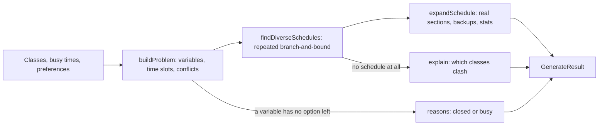

# Schedule generator (`lib/scheduler`)

This folder powers the **Generate** button in the schedule editor. Given the
classes in a schedule, the student's busy times and their preferences, it
returns up to 8 conflict-free schedules, best first, each clearly different
from the ones before it. When nothing fits, it says why.

Properties worth knowing before you change anything:

- **Exact by default.** On realistic inputs the first result is provably the
  best schedule for the stated preferences, found in a few milliseconds.
- **Bounded when it has to approximate.** If a search runs long (slow device,
  unusual input), it switches to a mode that guarantees results within 5% of
  the best, and it always stops at a hard time limit.
- **Off the main thread.** The page runs it in a Web Worker, so the dialog
  never freezes.
- **Pure functions.** Everything except the hook and the worker is plain
  TypeScript with no React or network access, so it is easy to test.

This is phase P1 ("solver core") of the schedule generator design doc.

## Contents

1. [Quick start](#quick-start)
2. [Glossary](#glossary)
3. [How it works](#how-it-works)
4. [Files and functions](#files-and-functions)
5. [Algorithms, why we use them, and their tradeoffs](#algorithms-why-we-use-them-and-their-tradeoffs)
6. [Approximation policy and performance](#approximation-policy-and-performance)
7. [Adding a new preference](#adding-a-new-preference)
8. [Assumptions to confirm](#assumptions-to-confirm)
9. [Differences from the design doc](#differences-from-the-design-doc)
10. [Testing and benchmarks](#testing-and-benchmarks)
11. [References](#references)

## Quick start

```ts
import { generateSchedules } from "@/lib/scheduler";
import { DEFAULT_PREFERENCES } from "@/lib/scheduler/preferences";

const result = generateSchedules(classes, events, DEFAULT_PREFERENCES);

result.schedules[0].classes; // [{ classIndex, sections: [{ sectionId, backups }] }]
result.quality; // { kind: "optimal" } | { kind: "near-optimal", gap } | { kind: "best-found" }
result.reasons; // why nothing fits, when schedules is empty
```

`classes` and `events` are the schedule's non-hidden `IScheduleClass` and
`IScheduleEvent` objects; they satisfy the input types in `types.ts` as they
are. In React, use the hook instead, which runs the same function in a worker:

```ts
const { result, loading, error } = useScheduleGenerator({
  classes,
  events,
  preferences,
  count: 8,
  enabled: dialogIsOpen,
});
```

## Glossary

| Term             | Meaning here                                                                                                                                                          |
| ---------------- | --------------------------------------------------------------------------------------------------------------------------------------------------------------------- |
| Class            | One lecture plus the discussions and labs tied to it (Berkeleytime's `Class`).                                                                                        |
| Section          | One enrollable offering, with a 5-digit id (CCN), meeting times and seats.                                                                                            |
| Component        | The kind of section: LEC, DIS, LAB, ... A student takes one section per component.                                                                                    |
| Variable         | One decision the solver makes: which section to use for one component of one class.                                                                                   |
| Time slot        | All sections of one variable that meet at exactly the same times in the same weeks. They are interchangeable for scheduling, so the solver picks slots, not sections. |
| Conflict         | Two slots that meet on the same day at overlapping times in overlapping weeks.                                                                                        |
| Cost             | A number for how much a schedule goes against the preferences. Lower is better.                                                                                       |
| Per-slot cost    | The part of the cost that depends on one slot alone, for example minutes before the preferred start.                                                                  |
| Monotone cost    | The part that depends on the whole schedule but can only grow as meetings are added, for example days on campus.                                                      |
| Floor            | A lower bound: no completion of a partial schedule can cost less than its floor.                                                                                      |
| Branch-and-bound | Search that skips a partial schedule when its floor is no better than the best complete schedule found so far.                                                        |
| Gap              | A tolerance such as 5%: skip a branch unless it could beat the best by more than 5%.                                                                                  |
| Distance         | The number of variables in which two schedules use different slots.                                                                                                   |
| Backup           | A section that could replace a chosen one without changing anything else in the schedule.                                                                             |

## How it works



A worked example. Say a schedule has CS 61A, whose lecture has 40 discussions
at 14 distinct times and 30 labs at 12 distinct times.

1. **Build the problem** (`normalize.ts`). CS 61A becomes three variables:
   LEC (1 slot), DIS (14 slots), LAB (12 slots). The 40 discussions collapse
   to 14 slots because sections at the same time are interchangeable. Slots
   that overlap a busy time are dropped. Every pair of slots in different
   variables is checked once for overlap and the result stored.
2. **Search** (`search.ts`, called by `diversify.ts`). Branch-and-bound picks
   one slot per variable, cheapest first. It always works on the variable with
   the fewest options left. When it picks a slot, it removes every clashing
   slot from the other variables, so a dead end shows up immediately. It skips
   any partial schedule whose floor cannot beat the best found so far.
3. **Repeat for variety** (`diversify.ts`). The first search returns the
   cheapest schedule. Each later search must differ from every earlier result
   in at least half of the variables that have a choice, so results are not
   near-copies.
4. **Expand** (`expand.ts`). Each chosen slot becomes a real section. The solver
   keeps the student's current section if it is in the slot, otherwise picks
   the one most likely to have a seat. The other sections that would also fit
   become backups.
5. **Explain** (`explain.ts`). Runs only when nothing fits. It reports, for
   example, "CS 61A and Data 8 always overlap".

## Files and functions

| File                      | Function or type                                                                                                                             | What it does                                                                                                                                         |
| ------------------------- | -------------------------------------------------------------------------------------------------------------------------------------------- | ---------------------------------------------------------------------------------------------------------------------------------------------------- |
| `index.ts`                | `generateSchedules(classes, events, preferences, options?)`                                                                                  | Entry point. Runs the whole pipeline and returns `GenerateResult`.                                                                                   |
| `index.ts`                | `DEFAULT_OPTIONS`                                                                                                                            | `count: 8`, `softBudgetMs: 150`, `hardBudgetMs: 500`, `gap: 0.05`.                                                                                   |
| `types.ts`                | `GeneratorClass`, `GeneratorSection`, `GeneratorEvent`, `GenerateResult`, `Quality`, `Reason`, ...                                           | Public input and output shapes.                                                                                                                      |
| `normalize.ts`            | `buildProblem(classes, events, preferences)`                                                                                                 | Applies locks and exclusions, merges sections into slots, removes slots that hit busy times, computes slot costs and conflicts. Returns a `Problem`. |
| `normalize.ts`            | `Problem`, `Variable`, `Slot`                                                                                                                | The search's internal data.                                                                                                                          |
| `objective.ts`            | `WEIGHTS`                                                                                                                                    | How much each preference counts.                                                                                                                     |
| `objective.ts`            | `slotCost`, `dayCost`, `spanCost`                                                                                                            | Per-slot cost, monotone day cost, monotone time-on-campus cost.                                                                                      |
| `objective.ts`            | `seatRisk`, `fill`, `isClosed`, `bySeatAvailability`                                                                                         | Seat helpers used for scoring and for picking sections.                                                                                              |
| `search.ts`               | `search(problem, variableIds, previous, minDistance, clock, gap)`                                                                            | One branch-and-bound search. Returns the best choice, its cost and how it finished.                                                                  |
| `search.ts`               | `createClock(softMs, hardMs)`, `Clock`, `Finish`, `worseFinish`                                                                              | The shared time budget and how searches report finishing.                                                                                            |
| `diversify.ts`            | `findDiverseSchedules(problem, count, clock, gap)`                                                                                           | Runs `search` repeatedly to build the varied result list.                                                                                            |
| `expand.ts`               | `expandSchedule(problem, classes, choice, cost)`                                                                                             | Turns slots into sections with backups and stats.                                                                                                    |
| `expand.ts`               | `gapMinutes(intervals)`                                                                                                                      | Minutes between classes on the same day, ignoring passing time.                                                                                      |
| `explain.ts`              | `explain(problem, classCount, clock)`                                                                                                        | Finds which classes cannot fit together.                                                                                                             |
| `time.ts`                 | `toIntervals`, `roundListedEnd`, `toDateRange`, `rangesOverlap`, `intervalsOverlap`, `classMinutes`                                          | Parsing meeting times and dates, and overlap checks.                                                                                                 |
| `preferences.ts`          | `GeneratorPreferences`, `DEFAULT_PREFERENCES`, `sanitizePreferences`, `loadPreferences`, `savePreferences`, `toSundayFirst`, `toMondayFirst` | The preferences form's data, saved in `localStorage`.                                                                                                |
| `apply.ts`                | `applyGeneratedSelection(classes, generated)`                                                                                                | Applies a chosen result: changes only the selected sections of generated classes.                                                                    |
| `protocol.ts`             | `GenerateRequest`, `GenerateResponse`, `handleRequest`, `toGeneratorClasses`, `toGeneratorEvents`                                            | The worker's message format, shared by the worker and the main-thread fallback.                                                                      |
| `worker.ts`               | (module)                                                                                                                                     | Web Worker entry: answers each request with `handleRequest`.                                                                                         |
| `useScheduleGenerator.ts` | `useScheduleGenerator({ ...inputs, count, enabled })`                                                                                        | React hook: runs requests in the worker, drops stale answers, falls back to the main thread.                                                         |
| `fixtures.ts`             | `section`, `scheduleClass`, `realisticClasses`, `adversarialClasses`, ...                                                                    | Builders for tests and benchmarks. Not used by the app.                                                                                              |

## Algorithms, why we use them, and their tradeoffs

Each technique below is a standard method from the literature. Each entry says
what it does here, why we chose it, what it costs us, and where it comes from.

### 1. Model: a small constraint optimization problem

- **What.** One variable per (class, component); its values are time slots.
  Hard constraints: no two chosen slots overlap; busy times, locks and
  exclusions are respected. Soft preferences add up to a cost to minimize.
  This is the textbook constraint satisfaction model plus a cost (Russell and
  Norvig, ch. 6).
- **Why.** With 3-4 classes there are only 6-12 variables. The difficulty is
  that each has up to dozens of values, so raw combinations reach 10^8-10^14.
  Search over this model with good pruning handles that easily.
- **Tradeoff.** "Exactly one section per component" is built in. Optional
  components (for example Voluntary sections) need an explicit rule; see
  [Assumptions](#assumptions-to-confirm).

### 2. Merging interchangeable sections into time slots

- **What.** Sections of one component that meet at exactly the same times and
  weeks become one slot (`normalize.ts`). The real section is chosen afterwards
  (`expand.ts`).
- **Why.** For conflicts and time preferences such sections are
  interchangeable values in the sense of Freuder (1991), so removing all but
  one loses no schedule. It shrinks the search: in our realistic test input,
  3.2 x 10^8 raw combinations become about 10^6. It also stops the results
  from showing schedules that differ only in room.
- **Tradeoff.** Anything that depends on the specific section rather than its
  time cannot affect the search directly. Seat risk works around this by
  scoring each slot by its best section. Walking distance, which depends on
  rooms, will need the same trick or a re-ranking pass (planned for P2).

### 3. Scoring: a weighted sum of per-slot and monotone terms

- **What.** Cost = sum of weighted terms (`objective.ts`): minutes outside the
  preferred hours and seat risk (per slot); avoided days used, days on campus
  and time on campus (monotone).
- **Why.** A weighted sum is the simplest way to combine several goals into one
  score (Marler and Arora, 2004). Keeping every term per-slot or monotone is
  what makes a cheap, valid floor possible (next section). Valued constraint
  satisfaction (Schiex, Fargier and Verfaillie, 1995) is the general framework
  for this kind of soft-constraint scoring.
- **Tradeoff.** The weights are judgment calls and need tuning from real use.
  A weighted sum can miss some balanced trade-offs between goals; the presets
  in the UI hide this from students. The per-slot-or-monotone rule restricts
  how new terms may be written ([Adding a new preference](#adding-a-new-preference)).

### 4. Search: depth-first branch-and-bound with forward checking and MRV

- **What.** `search.ts` explores partial schedules depth first.
  - **Branch-and-bound** (Land and Doig, 1960): skip a partial schedule when its
    floor is at least the cost of the best complete schedule found so far.
  - **Forward checking** (Haralick and Elliott, 1980): after choosing a slot,
    remove clashing slots from the remaining variables; a variable with no
    options left ends the branch at once.
  - **MRV, or fail-first** (Haralick and Elliott, 1980): branch on the variable
    with the fewest options left. Within it, try slots cheapest first, so good
    schedules are found early and the bound tightens quickly.
- **Why.** It is exact, uses almost no memory, and needs no library. A general
  solver (an integer-programming or CP-SAT engine compiled to WebAssembly)
  would add megabytes to the page for no benefit at this size.
- **Tradeoff.** Worst-case time is exponential. In practice the floor below
  keeps searches to a few thousand nodes; the time budget covers the rest.

**Performance details.** Each slot keeps a list of the slots it conflicts
with, so forward checking touches only real clashes. Undo information is kept
on a stack and in one row per search depth, so nothing is allocated per node
except when a better schedule is found. The clock is read every 256 nodes
because reading it costs more than visiting a node.

#### Why the floor is valid

The floor of a partial schedule is:

```math
\mathrm{floor}(P) = \sum_{s \in P} \mathrm{cost}(s) + \sum_{v \notin P} \min_{s \in \mathrm{live}(v)} \mathrm{cost}(s) + \mathrm{monotone}(P \cup F)
```

- Per-slot costs of chosen slots are final. Each open variable will add at
  least its cheapest remaining slot.
- Monotone costs can only grow, so their value on the partial schedule is a
  lower bound. `F` adds the days that some open variable will use whichever
  slot it gets, which tightens the bound without breaking it.
- **Fewer gaps fits the rule.** Gap time is time on campus minus class time.
  Class time is charged per slot (each slot pays for how much less class time
  it has than the longest slot of its variable), and time on campus is
  monotone. A version that scored gaps directly was not monotone. In the
  prototype it ran over 9 seconds without finishing on the worst-case input,
  against 5-18 ms with this formulation.

### 5. Approximation: anytime search with a relative gap

- **What.** All searches in one call share a clock (`createClock`). Up to the
  soft budget (150 ms) pruning is exact. After it, a branch is skipped unless
  it could beat the best schedule by more than the gap (5%):
  `floor * (1 + gap) >= best`. At the hard budget (500 ms) every search stops
  and returns the best schedule found so far.
- **Why.** This is an anytime algorithm (Dean and Boddy, 1988; Zilberstein,
  1996): it always has an answer, and the answer improves with time. The gap
  rule is bounded-suboptimal search, the idea behind A\*epsilon (Pearl and Kim, 1982) and behind the relative optimality gap in integer-programming solvers.
  It keeps a guarantee: when the search finishes after the switch, each result
  costs at most 5% more than the best possible schedule under the same
  constraints.
- **Tradeoff.** Results after the switch may be up to 5% worse. After the hard
  budget there is no guarantee at all. `GenerateResult.quality` reports which
  case applied, and the dialog tells the student.

### 6. Variety: a greedy sequence of distance-constrained searches

- **What.** `diversify.ts` asks for the cheapest schedule, then repeatedly for
  the cheapest schedule that differs from every earlier result in at least `d`
  variables. `d` starts at half the variables that have a choice and drops by
  one only when no schedule that far away exists. This is the greedy approach
  to Hebrard et al.'s "k solutions at least d apart" problem (Hebrard, Hnich,
  O'Sullivan and Walsh, 2005).
- **Why.** Ranking purely by cost returns near-copies. In our tests the top 20
  differed from the best in only 1-3 of 6 choices. The design doc first
  planned to take the top 200 and pick a varied subset with MMR (Carbonell and
  Goldstein, 1998). That fails when many schedules tie (for example with no
  preferences set), because the top 200 then all come from one corner of the
  search. The distance constraint works whether or not costs tie.
- **Tradeoff.** The second result is "the best schedule that is clearly
  different", not the second-best schedule overall. Each result costs one
  extra search; that is still a few milliseconds each. The constraint also
  prunes: a partial schedule is skipped once it can no longer reach the
  required distance.

### 7. Explaining "no schedule": small enumeration instead of QuickXplain

- **What.** `explain.ts` tests each class alone, then each pair of classes,
  and reports the smallest groups that cannot fit. Empty variables (every
  section closed, or every section hits a busy time) are reported earlier by
  `buildProblem`.
- **Why.** QuickXplain (Junker, 2004) finds a minimal conflict among many
  constraints. With 3-6 classes there are at most 21 groups to test, each a
  tiny search, so plain enumeration is simpler and just as precise.
- **Tradeoff.** It explains clashes between classes, not between a class and
  several busy times at once. If three classes conflict only together, it
  reports "No combination fits all of your classes at once".

### 8. Running in a Web Worker

- **What.** `useScheduleGenerator` sends a stripped-down copy of the inputs to
  `worker.ts` and ignores answers to outdated requests. If workers are
  unavailable or fail to load, the same code runs on the main thread.
- **Why.** Even a 50 ms search on a slow phone would make the dialog stutter
  if it ran on the main thread.
- **Tradeoff.** A request costs one copy of the inputs (tens of KB at most
  after stripping). A search cannot be interrupted once started; the hard budget
  bounds that wait.

### Methods we chose not to use

Genetic algorithms, simulated annealing and other local-search heuristics can
handle much larger problems, but they give no guarantee about how good a result
is and are harder to test. Exact search with an approximation fallback already
answers our input sizes in milliseconds, with a stated guarantee.

## Approximation policy and performance

**Performance expectation.** Results should arrive within 100 ms at the 95th
percentile on a mid-range phone, inside the worker. Exactness is worth paying
for only while it stays well inside that. Hence:

| Phase       | Time since the call started | Pruning                   | Guarantee reported         |
| ----------- | --------------------------- | ------------------------- | -------------------------- |
| Exact       | 0-150 ms                    | `floor >= best`           | `optimal`                  |
| Approximate | 150-500 ms                  | `floor * 1.05 >= best`    | `near-optimal` (within 5%) |
| Stop        | 500 ms                      | none, return what we have | `best-found`               |

**Measured** on the synthetic inputs in `fixtures.ts`, on a development
machine (Node 22, after warm-up), producing 8 results. Mean of `vitest bench`:

| Input                                                                               | Exact only | Default policy | 5% gap from the start |
| ----------------------------------------------------------------------------------- | ---------- | -------------- | --------------------- |
| Realistic: 4 large classes, 3.2 x 10^8 raw combinations                             | 4.8 ms     | 4.6 ms         | 3.1 ms                |
| Worst case: 4 x (60 discussions at 30 times + 60 labs at 30 times), 1.7 x 10^14 raw | 6.3 ms     | 6.4 ms         | 5.4 ms                |

Search size and result quality, averaged over 3 random seeds:

| Input and preferences         | Exact: nodes | 5% gap from start: nodes | Best schedule's cost, exact vs 5% | Cost of all 8, exact vs 5% |
| ----------------------------- | ------------ | ------------------------ | --------------------------------- | -------------------------- |
| Realistic, fewer gaps         | 7,049        | 4,087                    | 1,570 vs 1,590                    | 13,270 vs 13,290           |
| Realistic, mixed preferences  | 4,447        | 2,455                    | 2,890 vs 2,890                    | 24,060 vs 24,210           |
| Worst case, fewer gaps        | 8,934        | 4,338                    | 1,500 vs 1,540                    | 12,000 vs 12,290           |
| Worst case, mixed preferences | 7,107        | 3,174                    | 2,780 vs 2,840                    | 22,240 vs 22,505           |

**What this means.**

- **Exact is the default.** Exact search finishes in single-digit
  milliseconds, roughly 15-80 ms on a phone 3-5 times slower. Approximating
  from the start would halve the nodes but save only 1-2 ms, at a cost of up
  to 2.5% in quality. It is not worth it by default.
- **When approximation starts.** The soft budget switches to the 5% mode only
  when exact search actually becomes expensive: a slow device or an unusual
  input.
- **Versus the previous solver.** The previous single-file solver (PR #1230)
  took 14-30 ms on the same inputs. This version takes 4-10 ms. The algorithm is the same; the
  main code difference is in `search.ts`, which uses conflict lists instead of
  scanning every slot and allocates nothing per node.

## Adding a new preference

1. **Decide which kind it is.**
   - Per-slot: it depends only on one slot, like the time window.
   - Monotone: adding a meeting can only increase it, like days on campus.

   If it is neither, rewrite it until it is. A reward ("prefer breaks")
   becomes a penalty on its opposite (long back-to-back runs). A
   non-monotone count can often be split into a per-slot part and a monotone
   part, as gaps are.

2. **Add it to `objective.ts`.** A per-slot term goes in `slotCost`. A
   monotone term needs its own function, included in both the partial cost
   and the floor in `search.ts`.
3. **Add the field** to `GeneratorPreferences`, `DEFAULT_PREFERENCES` and
   `sanitizePreferences`, and a control in the dialog.
4. **Add a brute-force test** in `index.test.ts`, like "puts the true best
   schedule first". It catches a term that breaks the floor, because the
   solver would then return a worse schedule than brute force finds.

Example: "keep a 30-minute lunch break between 11:00 and 14:00" is monotone:
adding meetings can only shrink free time. It would need per-day busy
intervals in the search state, not just first start and last end.

## Assumptions to confirm

These depend on the Phase 0 data check:

- **Berkeley time.** End times ending in :x9 are rounded up one minute
  (`roundListedEnd`), because SIS lists 10:10-11:00 as 10:00-10:59. If stored
  times differ, change only that function.
- **Optional components.** Every component of a class is treated as required.
  If Voluntary (VOL) or Supplementary (SUP) sections, or non-enrollment
  sections (`type` N), turn out to be optional, `toGroups` in `normalize.ts`
  should skip them, and the API needs to expose `type`.
- **Date ranges.** Conflicts use each section's `startDate` and `endDate`.
  Meeting-level dates are not fetched by the schedule query.
- **Seat data freshness.** Seat risk uses `enrollment.latest`, which may be
  hours old during enrollment periods.

## Differences from the design doc

| Design doc                                             | This code                                                                | Why                                                                                                 |
| ------------------------------------------------------ | ------------------------------------------------------------------------ | --------------------------------------------------------------------------------------------------- |
| Top 200 by cost, then MMR for variety                  | Greedy distance-constrained searches                                     | Works when costs tie; see [Variety](#6-variety-a-greedy-sequence-of-distance-constrained-searches). |
| Stop after 250 ms or a node limit; label "proven best" | Exact until 150 ms, 5% gap until 500 ms, then stop; three quality labels | A stated guarantee instead of "not proven", and approximation only when exactness is expensive.     |
| Reuse `lib/schedule/conflict.ts`                       | Reuses `parseTime`; overlap checks run on pre-parsed integer intervals   | Comparing parsed numbers is much faster than re-parsing strings for every check.                    |
| "+N similar" and walking distance                      | Not yet                                                                  | Planned for P2.                                                                                     |
| Preferences saved per schedule                         | Saved once per browser                                                   | Simpler; most preferences are about the student, not the schedule.                                  |

## Testing and benchmarks

From `apps/frontend`:

```sh
npx vitest run src/lib/scheduler     # unit and brute-force tests
npx vitest bench src/lib/scheduler   # benchmarks in generate.bench.ts
```

- **`index.test.ts`**
  - Checks the solver against brute force on 40 random inputs: the best
    schedule must match, and every result must be conflict-free and distinct.
  - Checks that approximation stays within its gap.
  - Covers locks, exclusions, busy times, time-TBA meetings, date ranges,
    Berkeley time, backups, explanations, and both time budgets.
- **`time.test.ts`, `protocol.test.ts`, `apply.test.ts`,
  `preferences.test.ts`:** cover the smaller modules.

## References

- Carbonell, J., and Goldstein, J. (1998). The use of MMR, diversity-based reranking for reordering documents and producing summaries. SIGIR '98.
- Dean, T., and Boddy, M. (1988). An analysis of time-dependent planning. AAAI-88.
- Freuder, E. C. (1991). Eliminating interchangeable values in constraint satisfaction problems. AAAI-91.
- Haralick, R. M., and Elliott, G. L. (1980). Increasing tree search efficiency for constraint satisfaction problems. Artificial Intelligence 14(3).
- Hebrard, E., Hnich, B., O'Sullivan, B., and Walsh, T. (2005). Finding diverse and similar solutions in constraint programming. AAAI-05. https://cdn.aaai.org/AAAI/2005/AAAI05-059.pdf
- Junker, U. (2004). QUICKXPLAIN: Preferred explanations and relaxations for over-constrained problems. AAAI-04.
- Land, A. H., and Doig, A. G. (1960). An automatic method of solving discrete programming problems. Econometrica 28(3).
- Marler, R. T., and Arora, J. S. (2004). Survey of multi-objective optimization methods for engineering. Structural and Multidisciplinary Optimization 26(6).
- Pearl, J., and Kim, J. H. (1982). Studies in semi-admissible heuristics. IEEE Transactions on Pattern Analysis and Machine Intelligence 4(4).
- Russell, S., and Norvig, P. (2020). Artificial Intelligence: A Modern Approach, 4th ed., chapter 6 (Constraint Satisfaction Problems).
- Schiex, T., Fargier, H., and Verfaillie, G. (1995). Valued constraint satisfaction problems: hard and easy problems. IJCAI-95.
- Zilberstein, S. (1996). Using anytime algorithms in intelligent systems. AI Magazine 17(3).
