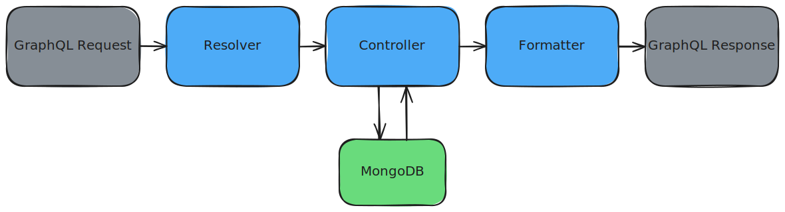

# Backend

Welcome to the backend section.

<!-- toc -->

## What is the backend?

The backend application service is the user-facing API server responsible for serving data to the frontend. Communication between the backend and frontend is done with HTTPS, as do most websites on the modern internet. To see more on how the backend service interacts with other components in the Berkeleytime system, view the [architecture page](../infrastructure/onboarding.md#architecture)

## The Berkeleytime Backend Service

### The Tech Stack

The backend uses the following technologies:

- **Programming Language:** [TypeScript](https://www.typescriptlang.org/)
- **Runtime Environment:** [NodeJS](https://nodejs.org/)
- **Web Server Framework:** [ExpressJS](https://expressjs.com/)
- **GraphQL Server[^1]:** [Apollo Server](https://www.apollographql.com/docs/apollo-server)

[^1]: As opposed to a simpler REST API, Berkeleytime uses a [GraphQL](https://graphql.org/) API design. This creates a more flexible backend API and allows the frontend to be more expressive with its requests.

### Codebase Organization

The backend codebase has a simple folder layout, as described below.

```
.
├── src
│   └── bootstrap                       # Bootstrapping and loading of backend dependencies
│       └── index.ts                    # Bootstrapping/Loading entrypoint.
│   └── modules                         # Business logic of the app divided by domain.
│       └── index.ts                    # Modules entrypoint.
│   ├── utils                           # Collection of utility function
│   ├── config.ts                       # Handles environment variable loading
│   └── main.ts                         # Backend entrypoint
└── codegen.ts                          # GraphQL code generation configuration file
```

Here is a list of services bootstrapped by the files in `src/bootstrap`:
- **Web Server Framework:** [ExpressJS](https://expressjs.com/)
- **GraphQL Server:** [Apollo Server](https://www.apollographql.com/docs/apollo-server)
- **Authentication:** [Passport](https://www.passportjs.org/)
- **MongoDB ORM:** [Mongoose](https://mongoosejs.com/)
- **Cache Connection:** [Redis](https://redis.io/)

The bulk of the application logic is split into separate modules within the `src/modules` directory. A module contains a collection of files necessary to serve the GraphQL queries for its domain. The file structure of the modules are all very similar. Below is the user module as an example:

```
.
├── src
│   └── modules
│       └── user                        # User module (as an example)
│           └── generated-types         # Generated types from codegen
│               └── module-types.ts     # Relevant Typescript types of GraphQL type definitions
│           └── typedefs                # GraphQL type definitions
│               └── [schema].ts         # A type definition for a schema
│           ├── controller.ts           # Collection of DB-querying functions
│           ├── formatter.ts            # (Optional) Formats DB models to GraphQL type
│           ├── index.ts                # Entrypoint to the module
│           └── resolver.ts             # GraphQL resolver
```

### Inside a Module

<p align="center">
    
</p>

The above diagram shows a simplified request-to-response pipeline within a module.

1. A [GraphQL request](https://graphql.org/learn/queries/) is sent to the backend server. A request looks like a JSON skeleton, containing only keys but no values. The request is "routed" to the specific module.[^1]

2. The resolver handles the request by calling the specific controller method necessary. For more information on how the resolver should be designed, it is recommended to consult the [Apollo Server documentation on resolvers](https://www.apollographql.com/docs/apollo-server/data/resolvers).

3. The controller queries the database, using user input to filter documents. We use [Mongoose](https://mongoosejs.com/) as an abstraction layer between our application logic and MongoDB queries.[^2] Both [Mongoose docs](https://mongoosejs.com/docs/index.html) and [MongoDB docs](https://www.mongodb.com/docs/manual/crud/) on queries are valuable resources.

4. The formatter translates the DB response from a database type, from `berkeleytime/packages/common/src/models`, into a GraphQL type, from `[module]/generated_types/module-types.ts`. Note that not all modules have a formatter because the database type and GraphQL type are sometimes identical.

5. Finally, the result is returned as a [GraphQL response](https://graphql.org/learn/response/) in the shape of a JSON, matching the query from step 1.[^3]

[^1]: In runtime, all of the modules and type definitions are merged into one by `src/modules/index.ts`, so there isn't any explicit "routing" in our application code.

[^2]: The Mongoose abstraction is very similar to the built-in MongoDB query language.

[^3]: Fields not requested are automatically removed.
