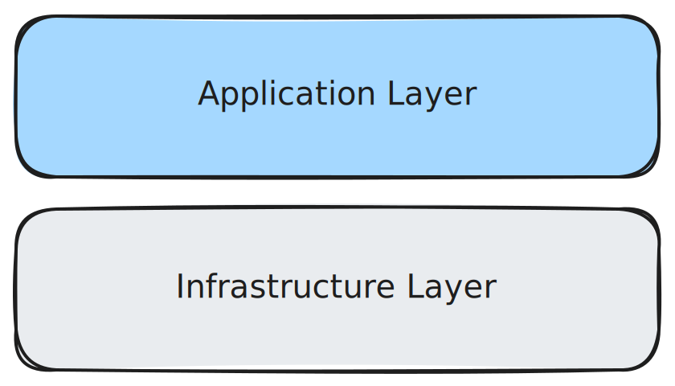

# Infrastructure

Welcome to the infrastructure section.

> [!NOTE]
> Infrastructure concepts tend to be more complex than application concepts. Don't be discouraged if a large amount of content in the infrastructure section is confusing!

## What is Infrastructure?

Software infrastructure refers to the services and tools that create an underlying layer of abstractions that the application is developed on. Compared to the application layer, infrastructure is significantly more broad in its responsibilities, although these responsibilities are more common in software development.

> [!IMPORTANT]
> We aim to use a **small** set of **existing** infrastructure solutions with large communities. This philosophy reduces the [cognitive load](https://thevaluable.dev/cognitive-load-theory-software-developer/) on each developer and simplifies the onboarding process, both of which are valuable for creating long-lasting software in a team where developers are typically cycled out after only ~4 years.
