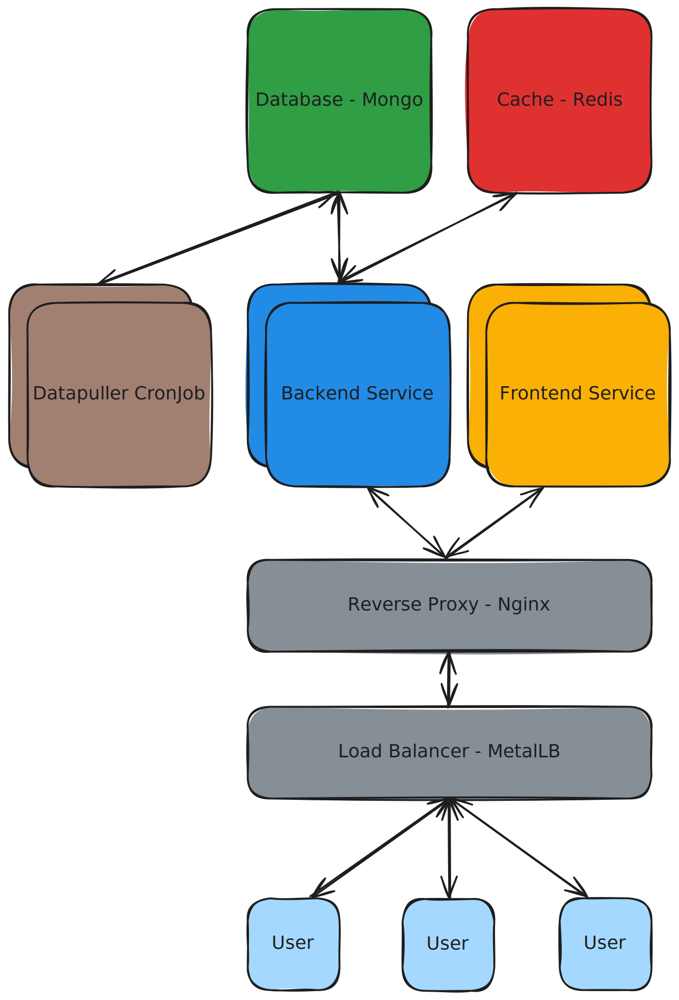

# Architecture

Berkeleytime uses a fairly simple microservices architecture—we decouple only a few application components into separate services. Below is a high-level diagram of the current architecture (switch to a light viewing mode to see arrows).

    

Note that, other than the application services developed by us, all other services are well-known and have large communities. These services have many issues already posted online, streamlining the setup and debugging processes.

## An HTTP Request's Life

1. An HTTP request starts from a user's browser. For example, when a user visits `https://berkeleytime.com`, a `GET` request is sent to the `hozer-51` machine.[^1]

2. Once the request reaches the `hozer-51` machine, it is first encountered by `hozer-51`'s Kubernetes cluster load balancer, a [MetalLB](https://metallb.io/) instance, which balances external traffic into the cluster across nodes.[^2]

3. Next, the request reaches the [reverse proxy](https://www.cloudflare.com/learning/cdn/glossary/reverse-proxy/), an [nginx](https://nginx.org/) instance, which forwards HTTP requests to either the [backend](../backend) or [frontend](../frontend/) service based on the URL of the request.
    - Requests with URLs matching `https://berkeleytime.com/api/*` are forwarded to the backend service.
    - All other requests, are forwarded to the frontend service.

4. The request is processed by one of the services.
    - The backend service may interact with the MongoDB database or the Redis cache while processing the request. Requests sent from the backend to the database or cache are *not* necessarily HTTP requests.

5. Finally, an HTTP response is sent back through the system to the user's machine.

[^1]: More specifically, the user's machine first requests a DNS record of `berkeleytime.com` from a DNS server, which should return the `hozer-51` machine's IP address. After the user's machine knows the `hozer-51` IP address, the `GET` request is sent.
[^2]: Currently, we only have one node: `hozer-51`.
