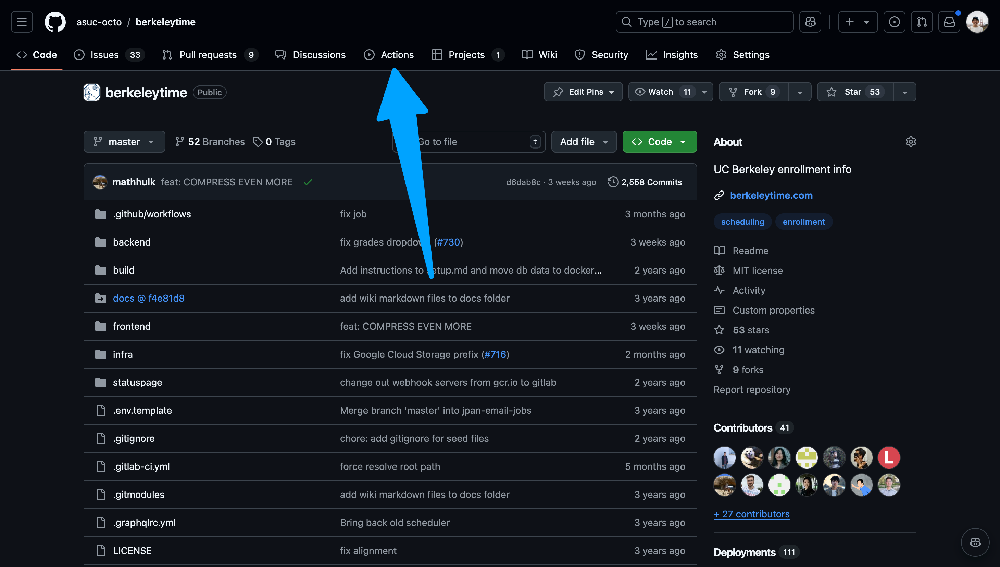
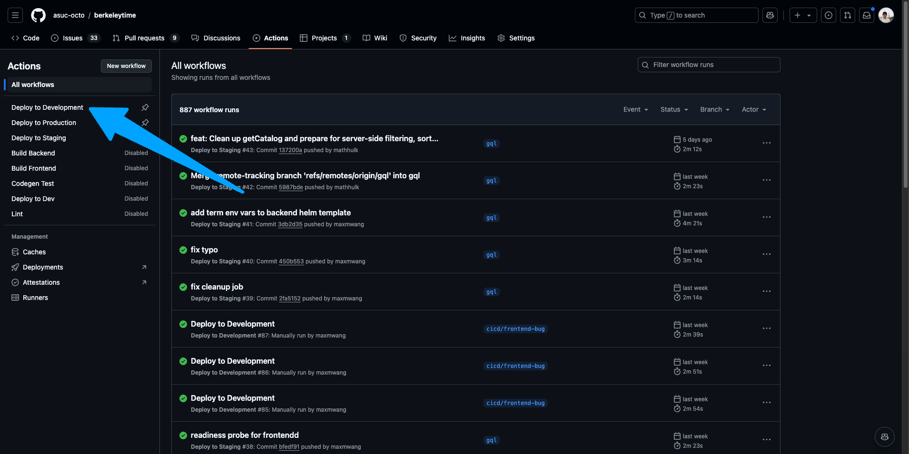
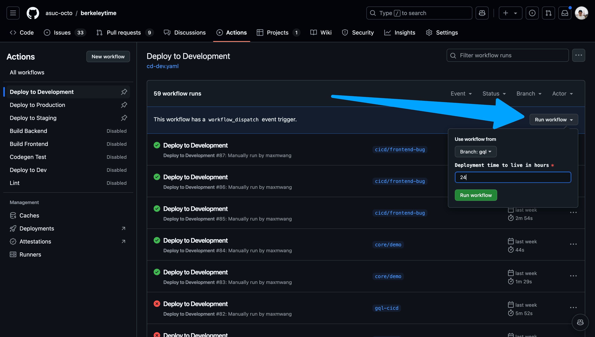
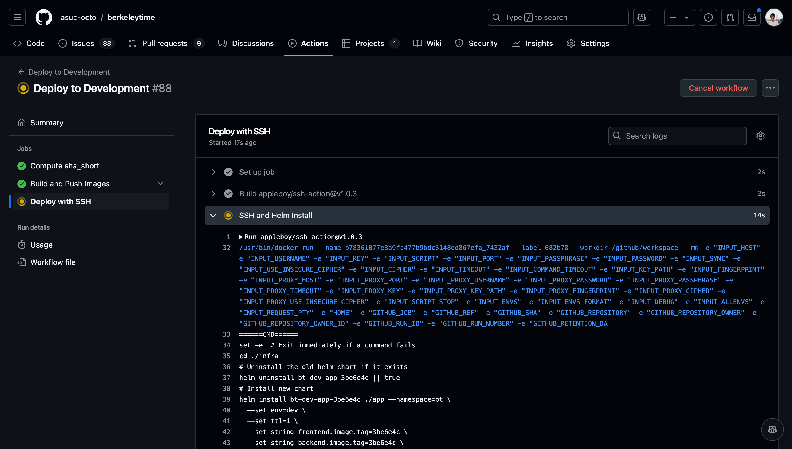

# Continuous Integration/Continuous Deployment

The deployment process is different for development, staging, and production environments.

## Development

1. Go to the [actions page](https://github.com/asuc-octo/berkeleytime/actions).
    <details><summary>Image</summary>

    

    </details>

2. Ensure "Deploy to Development" is the selected action on the left sidebar.
    <details><summary>Image</summary>

    

    </details>

3. Navigate to the "Run workflow" button on the right. Select your branch and input a time to live in hours. Please keep this value a reasonable number.
    <details><summary>Image</summary>

    

    </details>

4. Once the action starts running, click into the action and watch the status of each step. If the deployment fails, the action will fail as well.
    <details><summary>Images</summary>

    
    You can view the logs of each step by navigating the left sidebar.
    

    </details>

5. After the action succeeds, go to `www.abcdefg.dev.stanfurdtime.com`, where `abcdefg` is the first 7 characters of the latest commit's hash. This is also shown on the summary tab of an action workflow.

    <details><summary>Example Success Deployment Log</summary>

    ```
    ======CMD======
    set -e  # Exit immediately if a command fails
    cd ./infra
    # Uninstall the old helm chart if it exists
    helm uninstall bt-dev-app-3be6e4c || true
    # Install new chart
    helm install bt-dev-app-3be6e4c ./app --namespace=bt \
      --set env=dev \
      --set ttl=1 \
      --set-string frontend.image.tag=3be6e4c \
      --set-string backend.image.tag=3be6e4c \
      --set host=3be6e4c.stanfurdtime.com \
      --set mongoUri=mongodb://bt-dev-mongo-mongodb.bt.svc.cluster.local:27017/bt \
      --set redisUri=redis://bt-dev-redis-master.bt.svc.cluster.local:6379 \
      --set nodeEnv=development
    # Check container status
    kubectl rollout status --timeout=180s deployment bt-dev-app-3be6e4c-backend
    kubectl rollout status --timeout=180s deployment bt-dev-app-3be6e4c-frontend
    ======END======
    out: release "bt-dev-app-3be6e4c" uninstalled
    out: NAME: bt-dev-app-3be6e4c
    out: LAST DEPLOYED: Wed Nov 13 03:25:20 2024
    out: NAMESPACE: bt
    out: STATUS: deployed
    out: REVISION: 1
    out: TEST SUITE: None
    out: Waiting for deployment "bt-dev-app-3be6e4c-backend" rollout to finish: 0 of 2 updated replicas are available...
    out: Waiting for deployment "bt-dev-app-3be6e4c-backend" rollout to finish: 1 of 2 updated replicas are available...
    out: deployment "bt-dev-app-3be6e4c-backend" successfully rolled out
    out: deployment "bt-dev-app-3be6e4c-frontend" successfully rolled out
    ==============================================
    ✅ Successfully executed commands to all host.
    ==============================================
    ```

    </details>
