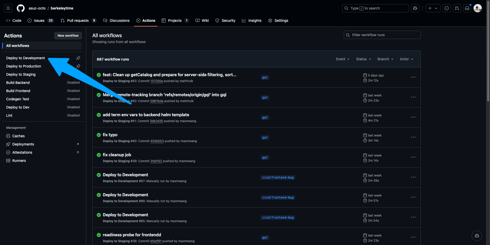
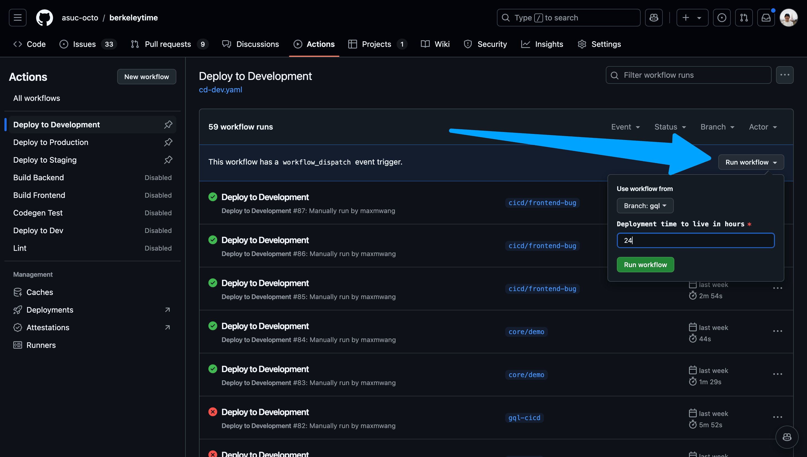
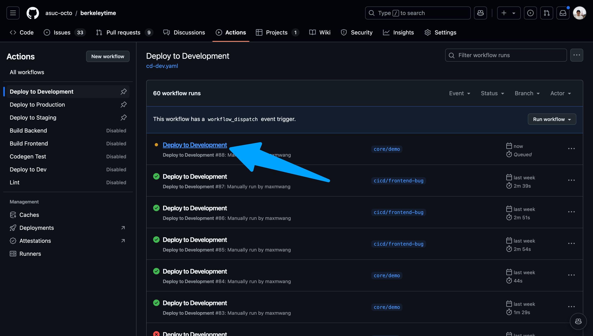
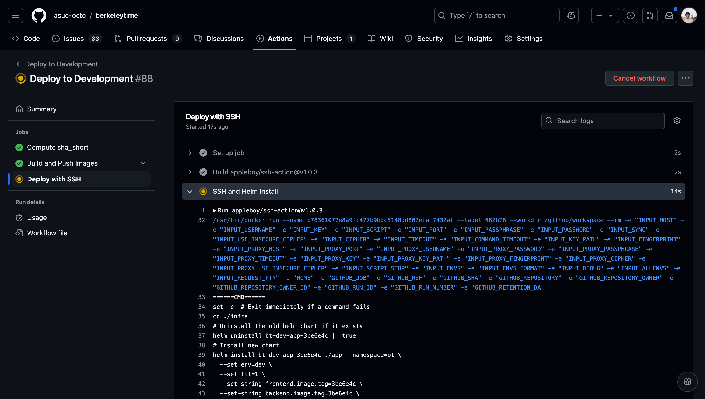
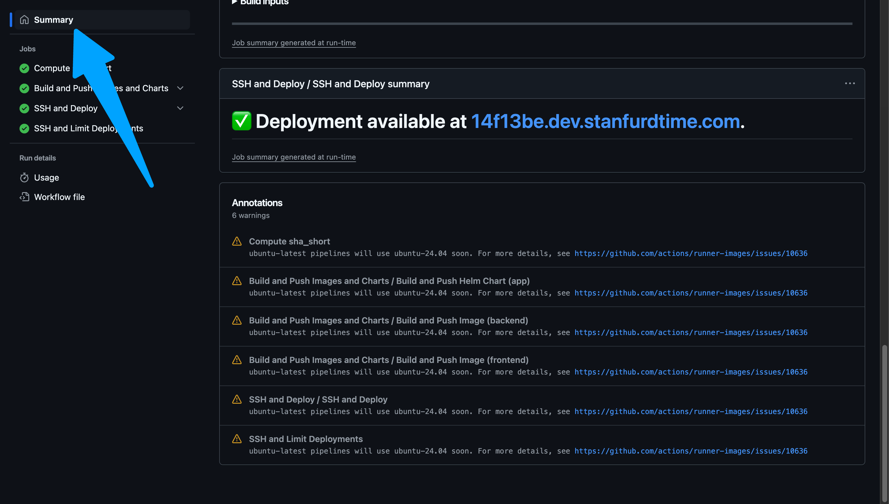

# Deployment with CI/CD

The deployment process is different for [development](#development), [staging](#staging), and [production](#production) environments.
- **Development**: Best for short-term deployments to simulate a production environment as closely as possible. Useful for deploying feature branches before merging into `master`.
- **Staging**: The last "testing" environment to catch bugs before reaching production. Reserved for the latest commit on `master`.
- **Production**: User facing website! Changes being pushed to production should be thoroughly tested on a developer's local machine and in development and staging environments.

## Development

1. Go to the [actions page](https://github.com/asuc-octo/berkeleytime/actions).
    <details><summary>Image</summary>

    

    </details>

2. Ensure "Deploy to Development" is the selected action on the left sidebar.
    <details><summary>Image</summary>

    

    </details>

3. Navigate to the "Run workflow" dropdown on the right. Select your branch and input a time to live in hours. Please keep this value a reasonable number.
    <details><summary>Image</summary>

    

    </details>

4. Once the action starts running, click into the action and watch the status of each step. If the deployment fails, the action will fail as well.
    <details><summary>Images</summary>

    
    You can view the logs of each step by navigating the left sidebar.
    

    </details>

5. After the action succeeds, go to `www.abcdefg.dev.stanfurdtime.com`, where `abcdefg` is the first 7 characters of the latest commit's hash. This is also shown on the summary tab of an action workflow. A hyperlink to the deployment is also available near the bottom of the Summary page of the workflow run.

    <details><summary>Example Success Deployment Log</summary>

    ```
    ======= CLI Version =======
    Drone SSH version 1.8.0
    ===========================
    Release "bt-dev-app-69d94b6" does not exist. Installing it now.
    Pulled: registry-1.docker.io/octoberkeleytime/bt-app:0.1.0-dev.69d94b6
    Digest: sha256:e3d020b8582b8b4c583f026f79e4ab2b374386ce67ea5ee43aa65c6b334f9db0
    W1204 22:20:37.827877 2103423 warnings.go:70] unknown field "spec.template.app.kubernetes.io/instance"
    W1204 22:20:37.827939 2103423 warnings.go:70] unknown field "spec.template.app.kubernetes.io/managed-by"
    W1204 22:20:37.827947 2103423 warnings.go:70] unknown field "spec.template.app.kubernetes.io/name"
    W1204 22:20:37.827952 2103423 warnings.go:70] unknown field "spec.template.env"
    W1204 22:20:37.827956 2103423 warnings.go:70] unknown field "spec.template.helm.sh/chart"
    NAME: bt-dev-app-69d94b6
    LAST DEPLOYED: Wed Dec  4 22:20:36 2024
    NAMESPACE: bt
    STATUS: deployed
    REVISION: 1
    TEST SUITE: None
    Waiting for deployment "bt-dev-app-69d94b6-backend" rollout to finish: 0 of 2 updated replicas are available...
    Waiting for deployment "bt-dev-app-69d94b6-backend" rollout to finish: 1 of 2 updated replicas are available...
    deployment "bt-dev-app-69d94b6-backend" successfully rolled out
    deployment "bt-dev-app-69d94b6-frontend" successfully rolled out
    ===============================================
    ✅ Successfully executed commands to all hosts.
    ===============================================
    ```

    

    </details>

## Staging

The staging CI/CD pipeline is automatically run on every push to `master` (currently `gql`). The staging website can be viewed at `staging.stanfurdtime.com`.

## Production

The production CI/CD pipeline is manually run with a process similar to the development pipeline. However, the production pipeline can only be run on `master` and `gql`.
